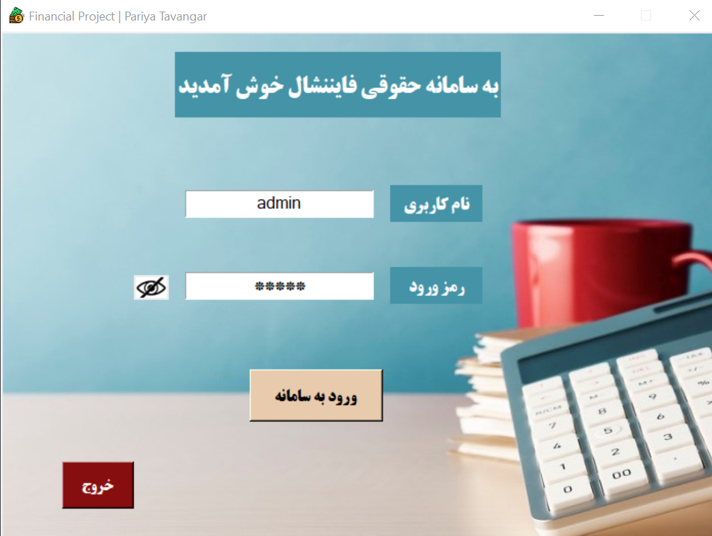

# Salary-Calculation | Python
# Financial Project - Via Windows📑
### Based on tkinter library

## Developer Todo 📝
- [x] [Fixing adding system]()
- [x] [Conflict in exit]()
- [x] [Fixing row number in del.row]()
- [x] [Adding status checking]()
- [x] [Main Page sudden crash]()
- [x] [Working on gui]()

     

## Feature ⚙
* Latest Tkinter version
* Using keyboard Shortcuts

## How to Run ▶
1- Set your directory on the project file
2- Open the project with "login.py"
-------------------
➡ Also You Can directly Run Python Shell with login.py

## Countribute 🤝
Feel free to contribute

## Communication 💌
* [Website](https://www.pariya-tavangar.ir)
* [Github](https://github.com/Ptavangar)
